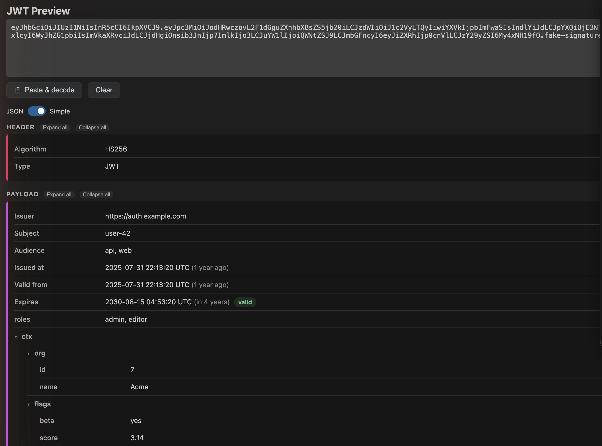

# JWT Preview

A Visual Studio Code extension for viewing JWT token contents in a clear,
readable format. Paste a token or select one in the editor to inspect its
Header and Payload as readable JSON, with standard claims formatted for quick
reading.



## Privacy

No telemetry. No network requests. Tokens are never stored.

Decoding happens on your machine, inside a webview whose Content Security
Policy blocks network access entirely (`default-src 'none'`,
`connect-src 'none'`). The extension has no runtime dependencies, reads the
clipboard only when you press the paste button, and does not retain any data
after the panel is closed.

## Features

- Live decoding as you type or paste.
- Header and Payload rendered as a collapsible JSON tree; the Signature
  segment is displayed as-is.
- Standard claims formatted where present: `exp`, `iat`, `nbf`, `iss`, `sub`,
  `aud` — with UTC timestamps, relative times, and expiration status.
- Correct Base64URL and UTF-8 handling, including non-Latin characters.
- Follows the editor theme (light, dark, high contrast).

## What it does not do

The extension does not verify signatures — that would require the signing key
or secret. It decodes and displays token contents only. A decoded token tells
you nothing about whether the token is authentic or trustworthy.

## Usage

Open the Command Palette (`Ctrl/Cmd+Shift+P`), run **JWT: Open Preview**, and
paste a token into the input field.

To decode a token that is already in your editor: select it, right-click, and
choose **JWT: Decode Selected Token**.

## Installation

Install "JWT Preview" from the Visual Studio Code Marketplace, or download a
`.vsix` from the repository's Releases page and install it via
`Extensions: Install from VSIX...`.

## Feedback and security

- Bugs and feature requests: [GitHub Issues](https://github.com/Beata-Humeniuk/jwt-preview/issues)
- Security issues: see [SECURITY.md](SECURITY.md) — please never include real
  tokens in reports.

## Development

```bash
npm install
npm run compile   # compile TypeScript to out/
npm run watch     # compile in watch mode
npm test          # run the test suite
npm run package   # build the .vsix
```

To run the extension for testing, open this folder in VS Code and press `F5`
(Extension Development Host).

## License

[MIT](LICENSE) — see also the [changelog](CHANGELOG.md).
