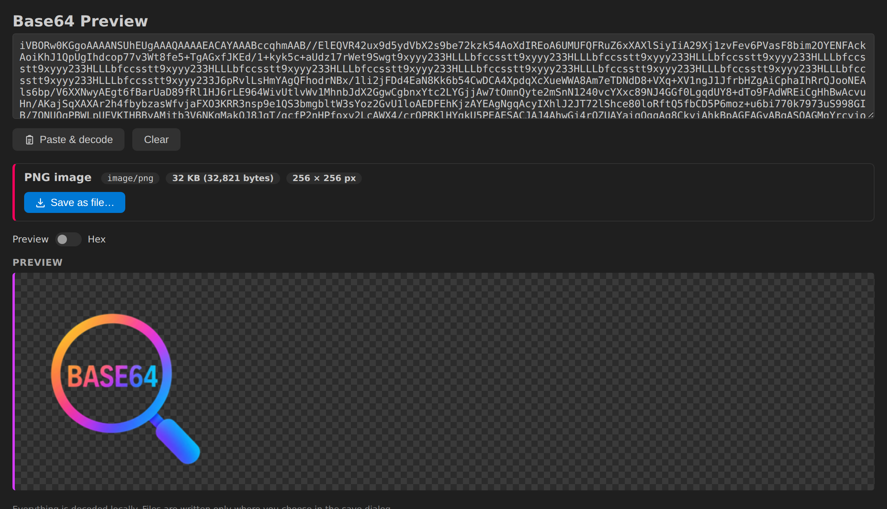

# Base64 Preview

A Visual Studio Code extension for seeing what a piece of Base64 actually is.
Copy some Base64, paste it, or select it in the editor, and the panel decodes
it, works out what it contains — text, JSON, an image, a PDF, an archive, a
font — and shows it in the most useful way it can. Whatever it is, you can save
it as a real file with the right extension, without anything leaving your
machine.

## Privacy

No telemetry. No network requests. Nothing you paste is stored. The clipboard
is read only when you run a command, and never written to unless you press a
copy button. Files are written only where you choose in the save dialog.

Decoding and file-type detection run entirely on your machine. See
[SECURITY.md](SECURITY.md) for the full scope.

## Features

- Live decoding as you type or paste.
- Picks up Base64 straight from the clipboard or the editor selection.
- Accepts bare Base64, `data:` URIs, the URL-safe alphabet, line-wrapped
  text, quoted strings and missing padding — and explains what is wrong when
  the text is not Base64 at all.
- Recognises what the bytes are from their signature: PNG, JPEG, GIF, WebP,
  SVG, BMP, ICO, AVIF, PDF, ZIP, DOCX, XLSX, PPTX, JAR, GZIP, 7z, RAR, TAR, MP3,
  WAV, OGG, FLAC, MP4, WebM, WOFF, TTF, OTF, SQLite, WebAssembly and more —
  and tells UTF-8 text, JSON, XML, HTML, PEM and JWTs apart from binary data.
- Shows the content in the most useful form: images inline, JSON as a
  collapsible tree, text as text, and everything else as a hex dump.
- **Save as file…** writes the decoded bytes to disk with a suggested name and
  extension that match the detected type, so a decoded `docx` opens in Word
  and a decoded `png` opens in an image viewer.
- **Open in editor** puts decoded text into a new editor tab with the right
  language mode; **Copy text** puts it on the clipboard.
- Flags a `data:` URI whose declared media type does not match the bytes.
- Follows the editor theme (light, dark, high contrast).

## How detection works

The decoded bytes are matched against the leading bytes ("magic numbers") of
well-known formats first. If none match, the bytes are decoded as UTF-8 (or as
UTF-16 when a byte order mark is present); text that decodes cleanly is then
classified by its content — JSON, SVG, HTML, XML, PEM, RTF, or a JWT — and
otherwise treated as plain text. A `data:` URI's media type is used to refine
a generic result (for example `text/csv`) but never to override what the bytes
themselves say. Bytes that are neither text nor a known format are shown as
"Binary data" with a hex dump, and can still be saved with a `.bin` extension.

Formats that have no inline preview in VS Code — PDFs, archives, Office
documents, audio, video — are identified and can be saved; open the saved file
in a suitable application.

## Usage

Copy some Base64, open the Command Palette (`Ctrl/Cmd+Shift+P`), and run
**Base64: Open Preview**. If the clipboard holds something shaped like Base64
or a `data:` URI, it is decoded straight away; otherwise paste it into the
input field.

To decode Base64 that is already in your editor: select it, right-click, and
choose **Base64: Decode Selection**. With nothing selected, this command falls
back to the clipboard as well.

Use the **Preview / Hex** toggle to switch between the rendered view and the
raw bytes. Press **Save as file…** to write the decoded content to disk; the
save dialog suggests a file name with the detected extension.

If the decoded text turns out to be a JSON Web Token, the companion
[JWT Preview](https://marketplace.visualstudio.com/items?itemName=beatahumeniuk.jwt-preview)
extension shows its claims in detail.

## Installation

Install "Base64 Preview" from the Visual Studio Code Marketplace, or download
a `.vsix` from the repository's Releases page and install it via
`Extensions: Install from VSIX...`.

## Feedback and security

- Bugs and feature requests: [GitHub Issues](https://github.com/Beata-Humeniuk/base64-preview/issues)
- Security issues: see [SECURITY.md](SECURITY.md) — please never include real
  data in reports.

## License

[MIT](LICENSE) — see also the [changelog](CHANGELOG.md).
